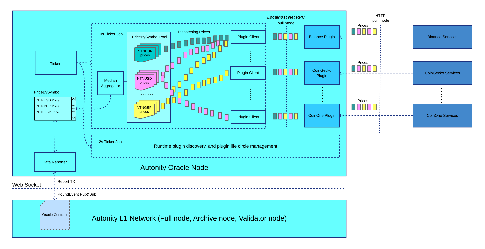

# Autonity Oracle Component 

## Assumptions 

This project assumes the following:

* Go 1.19.3 
* Linux / MacOS operating system

## Product introduction
This component works as the bridge that brings data points from different data provider and unifies the data into the standard format that exposed by HTTP service. To support the runtime adaptations with different data providers, the adapters are implemented in plugins mechanism thus it maintains high availability of the autonity oracle service. 
As the component starts ticker jobs that fetch data points from providers on every 10s timely, it also scans the plugin directory on every 2s to launch new plugins or to replace runtime plugins with newly modified one to adapt with data provider. By providing unified data service through HTTP RPC service, the autonity layer1 network can get the interested data for its stabilisation protocol.   



## Configuration 
Values that can be configured by using environment variables:    

| **Env Variable**        | **Required?** | **Meaning**                                                  | **Default Value**                  | **Valid Options**                |
|-------------------------|---------------|--------------------------------------------------------------|------------------------------------|----------------------------------|
| `ORACLE_HTTP_PORT`      | No            | The port that the HTTP service endpoint bind to              | `30311`                            | any free port number on the host |
| `ORACLE_CRYPTO_SYMBOLS` | No            | The symbols that the oracle component collect data point for | \"NTNUSDT,NTNUSDC,NTNBTC,NTNETH"\" | symbols seperated by ','         |
| `ORACLE_PLUGIN_DIR`     | No            | The directory that stores the plugins                        | "./plugins/"                       | any directory that saves plugins |
| `GIN_MODE`              | No            | The mode running by the HTTP service                         | "debug"                            | release or debug                 |

or by using console flags:

    $./autoracle -help
    Usage of ./autoracle:
    -oracle_crypto_symbols="NTNUSDT,NTNUSDC,NTNBTC,NTNETH": The symbols string separated by comma
    -oracle_http_port=30311: The HTTP service port to be bind for oracle service
    -oracle_plugin_dir="./plugins/": The DIR where the adapter plugins are stored

example to run the autonity oracle service with console flags:
    
    $./autoracle -oracle_crypto_symbols="NTNUSDT,NTNUSDC,NTNBTC,NTNETH" -oracle_http_port=30311 -oracle_plugin_dir="./plugins/"

## Developing

To run e2e test use

    make e2e_test

To run uint tests use
    
    make test

To generate code coverage reports run

    make test_coverage

To lint code run

    make lint

To build the project run

    make autoracle

The built binaries are presented at: ./build/bin under which there is a plugins directory saves the built plugins as well.

## Deployment
### Start up the service
Prepare the plugin binaries, and save them into the plugin directory, then start the service:
Set the system environment variables and run the binary:

    $export ORACLE_HTTP_PORT=63306
    $export ORACLE_CRYPTO_SYMBOLS="NTNBTC,NTNETH,NTNRMB"
    $export ORACLE_PLUGIN_DIR="./plugins/"
    $.~/src/autonity-oracle/build/bin/autoracle    

or configure by using console flags and run the binary:

    $.~/src/autonity-oracle/build/bin/autoracle -oracle_crypto_symbols="NTNUSDT,NTNUSDC,NTNBTC,NTNETH" -oracle_http_port=63306 -oracle_plugin_dir="./plugins/"

### Runtime plugin management
#### Adding new plugins
For new adaptations with newly added plugins, just put the new plugins into the service's plugin directory, the service auto discovery it and manage it. There is no other operations are required from operator.
#### Replace running plugins
To replace running plugins with new ones, just replace the binary under the plugin directory, the service auto discovery it by checking the modification time of the binary and do the plugin replacement itself, there is no other operations are required from operator.

## API specifications
The HTTP request message and response message are defined in json object JSONRPCMessage, it is carried by the HTTP body in both the request or response message, all the APIs are access with POST method by specifying the method and the corresponding method's params in params field, and the ID help the client to identify the requests and response pairing.
```go
    type JSONRPCMessage struct {
        ID     json.RawMessage `json:"id,omitempty"`
        Method string          `json:"method,omitempty"`
        Params json.RawMessage `json:"params,omitempty"`
        Result json.RawMessage `json:"result,omitempty"`
        Error  string          `json:"error,omitempty"`
    }
```

### get_version
This method return the oracle service version.

    curl -X POST -H "Content-Type: application/json" http://127.0.0.1:63306 --data '{"id":1, "method":"get_version", "params": []}'
```json
{"id":1,"result":{"Version":"0.0.1"}}
```    
### get_prices
This method returns all the symbols corresponding prices, and also the current symbols that is used by the oracle service.

    curl -X POST -H "Content-Type: application/json" http://127.0.0.1:63306 --data '{"id":1, "method":"get_prices", "params": []}'
```json
{"id":1,"result":{"Prices":{"NTNBTC":{"Timestamp":1672836542504,"Symbol":"NTNBTC","Price":"11.11"},"NTNETH":{"Timestamp":1672836542504,"Symbol":"NTNETH","Price":"11.11"},"NTNRMB":{"Timestamp":1672836542504,"Symbol":"NTNRMB","Price":"11.11"}},"Symbols":["NTNBTC","NTNETH","NTNRMB"]}}
```
### update_symbols
This method update the symbols of current oracle service, and returned the updated symbols once update is finished.

    curl -X POST -H "Content-Type: application/json" http://127.0.0.1:63306 --data '{"id":1, "method":"update_symbols", "params": ["NTNUSDC,NTNUSDT,NTNDAI"]}'
```json
{"id":1,"result":["NTNUSDC,NTNUSDT,NTNDAI"]}
```